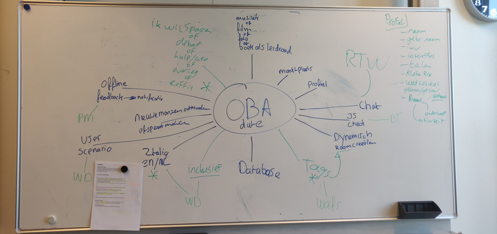

# OBA - Dating 

Feedbackgesprek: 
Intro
- zelf
- minor
- meesterproef

leerdoelen:
- specificeer
- rubrics koppelen aan leerdoelen
-

casus
- korte omschrijving
- gebruikers
- user requirements
- features

hoe heb ik mijn leerdoelen aan de features gekoppeld?
elke keer:
- screenshot van de app 
- snippet met code

conclusie

review met mark

## Inleiding
---

## Inhoudsopgave

### 1. Leerdoelen
### 2. Logboek
### 3. Design Rationale

---
---

## 1. Leerdoelen
---
| Naam Vak | Naam Leerdoel | Criteria | Comments |
| ----------- | ----------------- | -------- | ------ |
| *Web App From Scratch* | App structuur en code kwaliteit | Er is minimaal gebruik gemaakt van een IIFE en Object literals om structuur, in de vorm van modules aan te brengen en onnodige vervuiling van de globale scope te voorkomen. | 
| | Routing & States | Routing en States kunnen al dan niet met een micro library worden gemanaged. | 
| *Web Design* | User needs begrijpen en gebruiken in je ontwerp | Er is een user scenario geschreven dat aansluit bij de identiteit van jouw mens | | 
| | Leren hoe je principles in een ontwerp kan toepassen | Student kan uitleggen wat (interface)(design) principles zijn. | | 
*Real-Time Web* | Project | De app staat online. Uit de documentatie kan worden afgeleid wat het project inhoudt de data-life-cycle, real-time-events en externe databron zijn beschreven |

## 2. Logboek
---
#### 29-05-2019

Vandaag was de Kickoff van de meesterproef. 
Mark kon helaas niet en daarom hebben wij (iedereen die deze opdrachtgever heeft) samen met Janno (coach) gesproken. Vervolgens heb ik samen met met Joep een brainstormsessie gehouden. Het doel hiervan was bepalen welke features volgens de opgegeven user stories het belangrijkst zijn om te implementeren.
Resultaat brainstormsessie:

Later op de dag heb ik om het werk voor mijzelf overzichtelijker te maken heb ik een grove wireframe diagram getekend. Terwijl ik dit aan het schetsen was heeft Joost mij er korte feedback op gegeven. Dit heeft ertoe geleid dat de chat feature zo moet zijn uitgewerkt dat gebruikers items uit de OBA-API kunnen uploaden in de chat:

(zie links de wireframes, rechts een uitwerking van de chat feature)

#### 02-06-2019
Vandaag heb ik de Design Rationale besschreven in een google.docs bestand. Hierin heb ik de volgende elementen beschreven:
- Productbiografie
- Stakeholders Analyse
- User Requirements
- Feature List

#### 03-06-2019
Vandaag heb ik heb besloten om een duo te vormen met Joep Gravemaker voor deze meesterproef opdracht.

Wij hebben samen opnieuw wireframes ontworpen met daarin de routes die de gebruiker af gaat leggen:

####  04-06 Stan
- Alle routes toegevoegd in routes/router.js
- source en public folders toegevoegd
- style.css in header. 
- oproep plaatsen stapsgewijze layout toegevoegd in oproepPlaatsen.js (modulair met events.js) en oproepPlaatsen.ejs
- pages toegevoegd volgens wireframe

#### 06-06-2019
- Na zorgvuldig overleg zijn de producenten in overeenstemming met de wensen van de opdrachtgever tot besluit gekomen om de registratie feature van de applicatie te laten vallen. Er zal dus in het eindproduct geen profiel aangemaakt kunnen worden door de gebruiker. De reden hiervoor is het belang wat de opdrachtgever heeft bij privacy. Hij geeft aan in het beste geval helemaal geen data over zijn gebruikers te registreren. In de nieuwe opzet zullen de gebruikers 1 referentiepunt moeten geven waar de applicatie mee kan werken. Het is de bedoeling dat de gebruiker zijn/haar naam opgeeft en daardoor de authenticatie behoud binnen zijn/haar chat. 
- Mogelijk wordt hieraan toegevoegd dat de gebruiker ook een wachtwoord moet opgeven. 
De volgende data zal worden opgeslagen in een database:
- Gebruikersnaam
- Wachtwoord
- Berichten
- Geboortedatum

#### 12-06-2019
- Vandaag heb ik mij opnieuw verdiept in get implementeren van een database voor de API. Ook heb ik proefschetsen gemaakt voor de DLC (data life cyclus) en beschreven welke functies benodigd zullen zijn voor alle wijzigingen die doorgestuurd moeten worden naar de database.

- Vandaag heb ik mijn leerdoelen vastgesteld zoals die hierboven in de tabel zijn beschreven.

#### 13-06-2019

- In het feedbackgesprek met Koop Reynders hebben wij mijn leerdoelen doorgenomen. Koop heeft mij aangeraadden om een extra leerdoel van *Web Design* erbij te betrekken omdat het goed aansluit op het werk wat ik al gedaan heb. (Student kan uitleggen wat (interface)(design) Principles zijn)
- Vanochtend om 09:30 is er een extra gesprek geweest met opdrachtgever Mark. De reden hiervoor was dat zowel Joep als ik het concept definitief willen hebben zodat wij een duidelijke structuur hebben waar alleen nog kleine elementen aan veranderd kunnen worden. Mark heeft ons nog extra feedback gegeven op de 
- Tijdens het tweede gesprek om 14:30 vertelde Mark on over de app "koppel". Deze applicatie heeft vergelijkbare features met onze applicatie. Het is echter meer gericht op het ontwikkelen van de basisvaardigheden (bvb NT2). Mark raadde aan om een keer langs te gaan bij de ontwikkelaars hiervan op Amstel.
- - Joep, Mark en ik hebben nogmaals de applicatie doorgenomen en het design van Joep op Adobe XD

## 3. Design Rationale

####

