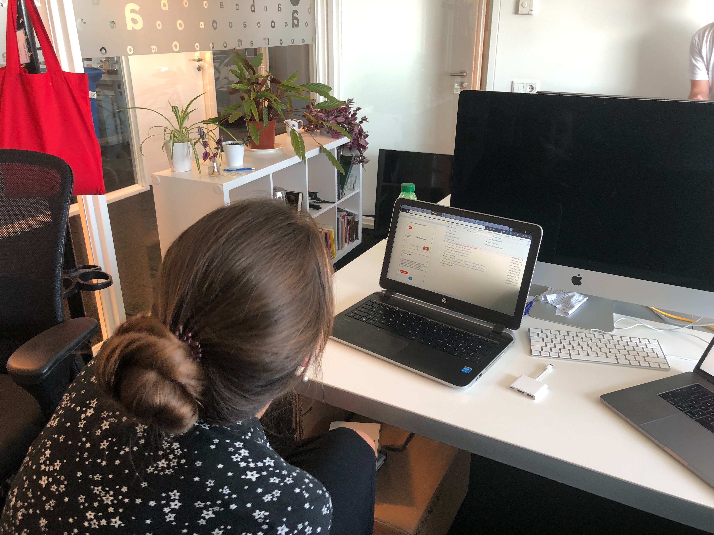

<!-- Feedbackgesprek: 
Intro
- zelf
- minor
- meesterproef

leerdoelen:
- specificeer
- rubrics koppelen aan leerdoelen

In de Meesterproef ga je toepassen wat je in de Minor Webdev hebt geleerd. 
Voor de Meesterproef krijg je een opdracht van een echte opdrachtgever. 
Je gaat leren hoe je je geleerde kennis en skils kan gebruiken om een oplossing voor een probleem te ontwerpen. Testen, maken, evalueren
, testen, maken ...
Je kan kiezen uit verschillende projecten. Hier ga je 5 weken aan werken 

casus
- korte omschrijving
- gebruikers
- user requirements
- features

hoe heb ik mijn leerdoelen aan de features gekoppeld?
elke keer:
- screenshot van de app 
- snippet met code

conclusie

review met mark

//////////
/

logo toevoegen
meer 
kleuren afstemmen
uitlijning verbeteren
ruimte geven aan elementen
@ bekijk ns site 

design review aanvragen bij minor visual interface
@Dennis Vragen
Joop Akeboom?

persoonlijk leerdoel: algemeen webdesign
CSS to the rescue

hoe te deployen --

readme: reflecteren op leedoelen 
-->

## Inleiding

Deze readme betreft mijn individuele documentatie over de meesterproef van de minor web development van de HBO-opleiding CMD jaargang 2018/2019. Hierin beschrijf ik onder andere mijn persoonlijke leerdoelen en de reflectie hierop na afloop van het proces en het logboek. Tijdens dit proces heb ik samengewerkt met Joep Gravemaker, Joep is student aan dezelfde minor. 

  

De repository van de meesterproef vind u door op de volgende link te klikken: https://github.com/japgroevemaker/Meesterproef-OBA-date/blob/master

## Inhoudsopgave

#### 1. Leerdoelen + Reflectie
#### 2. Logboek
#### 3. Design Rationale
#### 4. Over mij

------

## 1. Leerdoelen + Reflectie

✅  <strong>Behaald</strong>

➖ <strong>Deels behaald</strong>

🚫 <strong>Niet behaald</strong>

| Naam Vak | Naam Leerdoel | Criteria | Reflectie |
| ----------- | ----------------- | -------- | ------ |
| *Web App From Scratch* | App structuur en code kwaliteit | Er is minimaal gebruik gemaakt van een IIFE en Object literals om structuur, in de vorm van modules aan te brengen en onnodige vervuiling van de globale scope te voorkomen. | ✅ 
Doordat ik het overgrote deel van de geschreven code in object literals heb geschreven heb ik veel overzicht bewaard binnen de applicatie. Ik ben van mening dat dit mij in het proces erg heeft geholpen. Hierdoor kleine bugs en issues namelijk sneller en makkelijker te verhelpen. Ook kon ik hierdoor code makkelijk hergebruiken. bijvoorbeeld voor het plaatsen van een reactie: https://github.com/japgroevemaker/Meesterproef-OBA-date/blob/1ef8105bd59f42011d214346c0429fe683605055/public/javascript/reactions.js#L66 (code) 
|
Routing & States | Routing en States kunnen al dan niet met een micro library worden gemanaged. | Je hebt, met behulp van een micro library, routes toegepast naar een overzichts- en detailpagina | ➖ 
Dit leerdoel heb ik deels behaald. Ik heb de routes geïmplementeerd met express.js. deze worden op een overzichtelijke manier weergegeven. Doordat er in dit project gebruik is gemaakt van templating engine ejs, heeft mij dit ook in staat gesteld om data, verkregen vanuit post-requests, door te renderen naar de hieropvolgende pagina. In eerste instantie had ik dit niet op deze manier toegepast. Ik ging er vanuit doordat socket.io gebruikt wordt voor real-time renderen van data. Het makkelijker zou zijn om deze methode voor alle data te gebruiken. Tijdens het proces ben ik erachter gekomen dat dit zeker niet het geval is. Als reactie hierop heb ik de post-requests geïmplementeerd die op een betere, logischere manier de data meenemen naar verschillende pagina's. De data bevat input van de gebruiker in dit geval. Helaas heb ik mij naar mijn mening niet voldoende kunnen focussen op het bijhouden van states. Mijn bedoeling was om hiervoor zelf een state manager te gebruiken maar dit bleek te ver buiten de scope van de opdracht te zijn. In plaats hiervan heb ik meer tijd besteed aan het oplossen van bugs en fouten op de backend. Ik wil mijzelf deze zomer gaan verdiepen in vue.js en zal dan ook vuex gebruiken in de daarvoor bestemde repositories. 

| *Web App From Scratch* | User needs begrijpen en gebruiken in je ontwerp | Er is een user scenario geschreven dat aansluit bij de identiteit van jouw mens | ✅ 
Ik heb een user scenario beschreven in het design rationale in de readme van de repository van het eindproduct. (https://github.com/japgroevemaker/Meesterproef-OBA-date/blob/master/README.md) Hierin heb ik een voorbeeldgebruiker gepresenteerd die tegen een probleem op stuit, waar deze applicatie voor ontwikkeld is. Ik vertel hierin hoe de applicatie aan zijn specifieke behoefte kan voldoen. En waarom de gebruiker in het beste geval meteen deze applicatie kan zou moeten raadplegen. 
| 
*Real-Time Web* | Client-server interacties | De student kan door interactie het datamodel van de server in real-time beïnvloeden door direct data aan te passen. De student heeft eigenhandig data manipulaties opgezet. | ✅ 
Ik heb de real-time interacties van client en server opgezet. Dit houd in dat de client berichten en reacties kan plaatsen op het dashboard van de applicatie en deze worden real-time geüpdate bij andere clients.  Dit gebeurt doordat de data gebroadcast wordt van de server naar andere clients als in client -->server-->alle andere clients. Voor code zie ook: https://github.com/japgroevemaker/Meesterproef-OBA-date/blob/master/public/javascript/reactions.js 
|
*Real-Time-Web* | Data management | Het datamodel is op een slimme manier opgezet die van dieper inzicht getuigd. Je hebt een datamodel gecreeërd dat nauw aansluit op jouw app en data. | ✅
Wanneer er een post of reactie geplaatst wordt en er een real-time bericht van de client naar de server gestuurd wordt zal de server dit bericht verder verwerken. Zij zal voor verschillende CRUD (zonder D) operaties de benodigde functies activeren. Zo wordt de data van elk bericht opgeslagen middels mongoDB en mongoose op www.mlab.com Hiervoor is een model gemaakt in data/models/post.js: https://github.com/japgroevemaker/Meesterproef-OBA-date/blob/master/data/models/post.js .   Hier wordt vervolgens via promises invulling aan gegeven wanneer er een bericht opgeslagen dient te worden: https://github.com/japgroevemaker/Meesterproef-OBA-date/blob/master/source/savePost.js . Wanneer er een reactie geplaatst wordt, dient het bericht in de database geüpdate te worden en wordt de "reactions" property aangevult met de nieuwe reactie. Zie hiervoor ook: https://github.com/japgroevemaker/Meesterproef-OBA-date/blob/1ef8105bd59f42011d214346c0429fe683605055/source/socketServer.js#L55 .  Tijdens deze stap ondervond ik veel problemen met het correct opmaken van de model. MongoDB zal namelijk niet correct het bericht in de database updaten wanneer de gegeven data niet 100% in lijn ligt met de beschreven "type" in de database. Wat ik hierbij heb geleerd is dat als uitgangspunt het beste data zo gemanipuleerd diend te worden dat matched schema, ipv een schema manipuleren zodat het matched met de data. Dit geeft meer grip op errors doordat er specifiekere error-handling kan worden toegepast en dit heb ik dan ook gedaan middels kleurgecodeerde console.logs. Als laatste gebruikt de applicatie find methods (de R van CRUD) om bij een nieuwe reactie het correcte bericht te vinden door gebruik te maken van het specifieke ID van dat bericht wat in een verborgen element van de html zit. Ook heb ik geleerd hoe ik "relaties" op een logische manier kan "nesten" in een niet-relationele database. Dit werkt voor mij op dit moment goed maar in de nabije toekomst wil ik mij ook gaan verdiepen in SQL databases. 
 |
*Samenwerken* (Behoort niet tot een minor vak)| Ik wil mijn documentatie onderhouden middels Github Projects | Ik wil efficient gebruik maken van de UI die Github Projects biedt. Daarmee doel ik op het labelen van zowel issues als pull requests, het maken en mergen van branches en het verdelen van taken onder ontwikkelaars. | ✅ 
Ik heb dit leerdoel behaald. Ik heb zelf extra labels aangemaakt om niet gedekte eigenschappen te benadrukken binnen het project.  

### Reflectie op het proces:
Tijdens deze meesterproef heb ik mijzelf veel nieuwe kennis eigen kunnen maken. Een voorbeeld hiervan is het dieper nesten van objecten in mongoDB d.m.v. mongoose, terwijl ik in eerste instantie door veel errors en bugs de handdoek in de ring had gegooit. 

Ook heb ik mijn technische kennis naar een hoger niveau kunnen tillen. Dit komt doordat ik nu weet hoe ik een vloeiende combinatie kan maken met post-requests, express.js, ejs en socket.io . Waarmee ik "onload" data af kan geven aan de server en meegeven naar andere webpagina's en tegelijkertijd real-time interacties kan bedienen zonder dat de gehele pagina diend te worden herladen. Dit is iets wat niet meteen tot mijn inzicht kwam in het proces. pas halverwege het proces (zie logboek) kwam ik tot de ontdekking dat dit een veel meer solide aanpak is. 

Hoewel een sterk design ontwikkelen niet 1 van mijn belangrijkste leerdoelen was heb ik mijzelf ook hierin verder ontwikkeld. Met name in het bevorderen van gebruiksvriendelijkheid. Zo heb ik kleurcodering toegepast op de berichten in het dashboard op basis van het soort activiteit waar het over gaat.  Doordat dit in de gehele webapplicatie terugkomt is de gebruiker met niet tekstuele informatie altijd op de hoogte wat voor bericht hij/zij maakt en/of leest. Ook heb ik user-feedback toegepast wanneer men iets opgeeft wat niet gebruikt kan worden. Speciale tekens zijn bijvoorbeeld niet toegestaan in de titel van een bericht. De gerbuiker zal daarom ook nu een melding zien die dit aangeeft.

Betreft Samenwerking:

Ik vond het een erg leerzame en prettige ervaring om voor een project van deze omvang samen te werken met Joep. Ik heb het ervaren als een periode van hard werken en veel verdienen. Wij hebben ons gezamelijk hard gemaakt voor de wens van de opdrachtgever en het resultaat mag er zijn. Zowel onze opdrachtgever, coaches en andere docenten zijn zeer te spreken over onze samenwerking en daardoor geloof ik dat er wel een kern van waarheid in moet zitten. Wij hebben gedurende het gehele project goede afspraken gemaakt maar wisten zelfs buiten die afspraken om al wat we van elkaar konden verwachten. Het leek bijna alsof we al veel langer samen werkten.

## 2. Logboek

---

#### 29-05-2019

Vandaag was de Kickoff van de meesterproef. 
Mark kon helaas niet en daarom hebben wij (iedereen die deze opdrachtgever heeft) samen met Janno (coach) gesproken. Vervolgens heb ik samen met met Joep een brainstormsessie gehouden. Het doel hiervan was bepalen welke features volgens de opgegeven user stories het belangrijkst zijn om te implementeren.
Resultaat brainstormsessie:

Later op de dag heb ik om het werk voor mijzelf overzichtelijker te maken heb ik een grove wireframe diagram getekend. Terwijl ik dit aan het schetsen was heeft Joost mij er korte feedback op gegeven. Dit heeft ertoe geleid dat de chat feature zo moet zijn uitgewerkt dat gebruikers items uit de OBA-API kunnen uploaden in de chat:

(zie links de wireframes, rechts een uitwerking van de chat feature)

#### 02-06-2019
Vandaag heb ik de Design Rationale besschreven in een google.docs bestand. Hierin heb ik de volgende elementen beschreven:
- Productbiografie
- Stakeholders Analyse
- User Requirements
- Feature List

#### 03-06-2019
Vandaag heb ik heb besloten om een duo te vormen met Joep Gravemaker voor deze meesterproef opdracht.

Wij hebben samen opnieuw wireframes ontworpen met daarin de routes die de gebruiker af gaat leggen:

####  04-06 Stan
- Alle routes toegevoegd in routes/router.js
- source en public folders toegevoegd
- style.css in header. 
- oproep plaatsen stapsgewijze layout toegevoegd in oproepPlaatsen.js (modulair met events.js) en oproepPlaatsen.ejs
- pages toegevoegd volgens wireframe

#### 06-06-2019
- Na zorgvuldig overleg zijn de producenten in overeenstemming met de wensen van de opdrachtgever tot besluit gekomen om de registratie feature van de applicatie te laten vallen. Er zal dus in het eindproduct geen profiel aangemaakt kunnen worden door de gebruiker. De reden hiervoor is het belang wat de opdrachtgever heeft bij privacy. Hij geeft aan in het beste geval helemaal geen data over zijn gebruikers te registreren. In de nieuwe opzet zullen de gebruikers 1 referentiepunt moeten geven waar de applicatie mee kan werken. Het is de bedoeling dat de gebruiker zijn/haar naam opgeeft en daardoor de authenticatie behoud binnen zijn/haar chat. 
- Mogelijk wordt hieraan toegevoegd dat de gebruiker ook een wachtwoord moet opgeven. 
De volgende data zal worden opgeslagen in een database:
- Gebruikersnaam
- Wachtwoord
- Berichten
- Geboortedatum

#### 12-06-2019
- Vandaag heb ik mij opnieuw verdiept in get implementeren van een database voor de API. Ook heb ik proefschetsen gemaakt voor de DLC (data life cyclus) en beschreven welke functies benodigd zullen zijn voor alle wijzigingen die doorgestuurd moeten worden naar de database.

- Vandaag heb ik mijn leerdoelen vastgesteld zoals die hierboven in de tabel zijn beschreven.

#### 13-06-2019

- In het feedbackgesprek met Koop Reynders hebben wij mijn leerdoelen doorgenomen. Koop heeft mij aangeraadden om een extra leerdoel van *Web Design* erbij te betrekken omdat het goed aansluit op het werk wat ik al gedaan heb. (Student kan uitleggen wat (interface)(design) Principles zijn)
- Vanochtend om 09:30 is er een extra gesprek geweest met opdrachtgever Mark. De reden hiervoor was dat zowel Joep als ik het concept definitief willen hebben zodat wij een duidelijke structuur hebben waar alleen nog kleine elementen aan veranderd kunnen worden. Mark heeft ons nog extra feedback gegeven op de 
- Tijdens het tweede gesprek om 14:30 vertelde Mark on over de app "koppel". Deze applicatie heeft vergelijkbare features met onze applicatie. Het is echter meer gericht op het ontwikkelen van de basisvaardigheden (bvb NT2). Mark raadde aan om een keer langs te gaan bij de ontwikkelaars hiervan op Amstel.
- - Joep, Mark en ik hebben nogmaals de applicatie doorgenomen en het design van Joep op Adobe XD

#### 21-06-2019
Vandaag heb ik mij gebogen over een bug die ervoor zorgde dat de tags niet correct gerendered werden. Hier ben ik de hele dag mee bezig geweest maar uiteindelijk heb ik de oorzaak van het probleem gevonden. Wat bleek is dat tag container niet goed werd aangesproken in handleInput.js. 

#### 24-06-2019

Feedbackgesprek opdrachtgever:
- Vandaag hebben we feedback ontvangen over het design van de website. Met name de teksten die de gebruiker te zien krijgt zijn onder de loep genomen en bekritiseerd. 
- disclaimer
- autosuggest voor de tags aanmaken
- image verbinden aa categorieen --> bvb vlaggen, dieren en economie    
- menu knop in prikbord: animatie toevoegen --> laten faden met kleuren + sticky maken

#### 25-06-2019
Vandaag hebben Joep en ik de gehele werkdag van 10:00 tot 21:00 in de oba gewerkt aan het project. Verschillende bugs zijn opgelost en gedocumenteerd in github projects. Ook heeft een collega van de opdrachtgever onze applicatie getest en zij was hier zeer over te spreken!

#### 27-06-2019 

Vandaag was de markt
Joep en ik hebben enorm goede feedback ontvangen van zowel de docenten, coach als de opdrachtgever en verschillende personen die ons product kwamen testen. Het grootste aandachtspunt volgens de docenten en coach was de flow en design van de applicatie. Zij zouden graag nog willen zien dat alles correct is uitgelijnt en kleuren overeen komen.

#### 01-07-2019
Vandaag heeft Koop aanvullende feedback gegeven op het design en flow van onze applicatie. Hieruit is naar voren gekomen dat een aantal dingen niet logisch zijn ingedeeld. Doordat deze feedback vooral design gerelateerd was heb ik er veel van geleerd, ik ben namelijk nog steeds van mening dat dit niet 1 van mijn sterkere punten is. Hij gaf aan dat met name de layout van een bericht logisch dient te zijn. Verschillende elementen waren hierin niet goed vormgegeven en soms ook op een onlogische plek geplaatst. Joep heeft zich hierover gebogen en het aangepast. 

#### 02-07-2019
Doordat de reacties niet correct werden geupdate in de database waren wij niet in staat om de timestamps hiervan netjes te renderen. De reden hiervoor was dat de datum bij de reactie werd opgeslagen in dezelfde property. Ik was in de veronderstelling dat mongoDB niet in staat was om zo diep wijzigingen te "nesten". Nadat ik deskresearch heb uitgevoerd ben ik tot de conclusie gekomen dat dit wel mogelijk is. Dit heb ik vervolgens toegepast in het concept en nu werkt het zoals gewenst is.

#### 04-07-2019
Koop had in zijn feedback op afgelopen maandag (01-07) aangegeven dat hij een knop wilde om reacties te plaatsen i.p.v. dat de reacties al zichbaar zijn zodra je op de pagina komt. Hier is nu een uitklapmenu voor ontwikkeld en ik heb ervoor gezorgd dat deze nu realtime geupdate wordt wanneer men een reactie plaatst. Tevens heb ik als aanvulling op de UI ervoor gezorgd dat de kleurcodering van berichten nu ook bij het maken van een bericht al terugkomt. Zo klikt de gebruiker op een knop en beland vervolgens in een scherm die dezelfde kleur heeft.

## 3. Design Rationale

Ik heb de Design Rationale geschreven en geplaatst in de volgende repository:

https://github.com/japgroevemaker/Meesterproef-OBA-date/blob/master/README.md

## 4. Over mij

Hallo! Mijn naam is Stan Ooms. Tijdens mijn HBO opleiding voeding en new product management ontstond mijn interesse in Web Development. Wat ooit begon als een hobby is nu uitgegroeit tot dagelijkse bezigheid tijdens de minor Web Development aan de HvA. Ik wil mijzelf hierin graag verder blijven ontwikkelen in beide vakgebieden. Mijn ambitie is om beide eindjes aan elkaar te knopen en daarmee nieuwe webapplicaties te bouwen die gemaakt zijn om de voedingsmiddelenbranche verder te digitaliseren.
